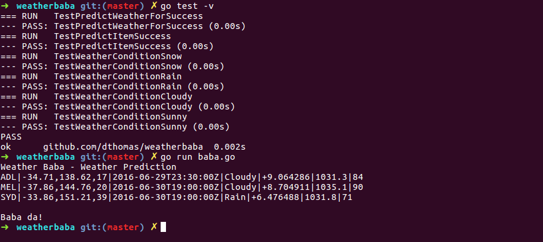

# :tada: Weather Baba :tada:

This small application predics the weather for given area. It uses linear regression to predict condition, temprature (°C), pressure (hPa) and relative humidity (%).

All the base data has been taken from [Bureau of Meteorology, Australia](http://www.bom.gov.au/climate/data/)

Currently, it uses data from following regions to predict weather:
* Adelaide
* Melbourne
* Sydney

The observed data for these locations are saved in data directory as CSV file. The format for this file is given below:
`
Location,Date,Lat,Long,Elevation,Gust,Temp,Humidity,Pressure,Rainfall
`
`
SYD,1466636400,-33.86,151.21,39,35,12.8,58,1012.6,0
`

Only data for the last seven days are recommended to include in the file.

## Build Instructions

* Ensure Golang is installed (https://golang.org/dl/)
* Use `go run baba.go` to get the predictions for `June 30, 2016 9:00 AM` Local Time
* To produce a binary, please use `go build`

## Screenshot

## Possible Enhancements
- [ ] Add more training data
- [ ] Add more features to the training data. eg: Add ocean currents information, upper atmosphere temprature etc.
- [ ] Add option for JSON output
